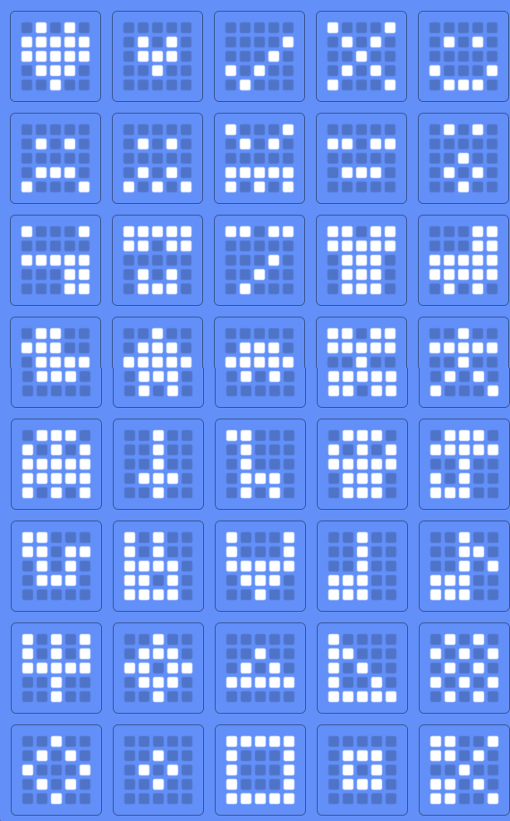

# Mini teams par radio

L'objectif de cet exercice est de permettre à plusieurs micro:bit de communiquer par radio aux moyens d'icône.
Nous détaillons les étapes à réaliser pour y arriver.

# Fonctionnement

Le programme se décompose en plusieurs parties : 
* La sélection du canal du groupe
* La sélection de l'icône à envoyer 
* L'envoi de l'icône
* L'affichage d'une icône reçue

# Etapes

* **Initialisation**
    * Au démarrage, générer aléatoirement un identifiant entre 0 et 9999
* **Canal radio**
    * Créer une fonction permettant d'incrémenter un numéro de canal et changer le canal radio avec cette valeur
    * Relier cette action à l'action d'appui sur le logo
* **Sélection d'icône**
    * Créer une fonction permettant d'incrémenter le logo courant et l'afficher.
        / ! \ Il n'y a que 40 icônes configurées
    * Relier cette action lors de l'appui sur le bouton A 
* **Envoi de l'icône**
    * Créer une fonction qui envoie un message radio avec l'identifiant et le numéro de l'icône séparé par un séparateur de votre choix
    * Relier cette fonction lors de l'appui sur le bouton B
* **Réception d'une icône**
    * Créer une fonction qui reçoit un message, récupère l'identifiant et le numéro d'icône et affiche l'identifiant, fait une pause puis affiche l'icône
    * Relier cette fonction à la réception d'un message

# Astuces
* [Documentation sur la manipulation radio](https://makecode.microbit.org/reference/radio)
* Le message le plus simple à envoyer est une chaîne de caractères. 
    / ! \ Attention, le message est limité à 19 caractères
* La méthode _randint_ permet de générer un entier entre deux bornes
* Identifiant généré
    * Il est possible de ne pas utiliser un identifiant généré : l'id de la carte est envoyée à chaque message.
    * Il est possible de le récupérer avec la fonction radio.receivedPacket
* Gestion des icônes
    * Les icônes peuvent être référencées à partir de l'enum IconNames ou directement à partir d'un entier
    * Il y a 40 icônes, de 0 à 39

Le fichier skeleton.ts vous donne une structure de code pour démarrer.

